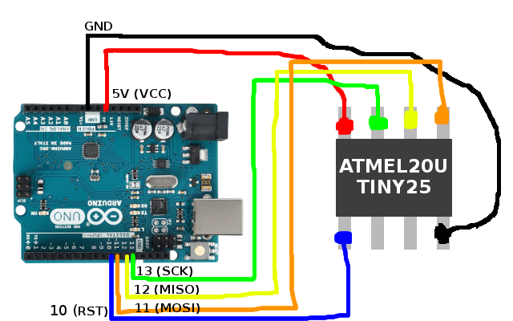

# 2018_defcon_badge

## About
This is a DEF CON 26 [Shitty Add-On](https://hackaday.io/project/52950-defcon-26-shitty-add-ons) badge created by HexaKhan (code) and BK (board + electronics). Best way to describe it is a "hacker roulette"

## Specs
Microcontroller used is the ATTINY25-20SSU running at 1MHz (CKDIV8) at 3.3V (but most testing was done with an ATTINY85-20PU)

## Flashing the chip
There are 2 things happening when we flash the chip:
1. Flashing the program
2. Setting the proper fuses

Be aware that once you set the fuses, you will **not** be able to reprogram unless you have an HVSP programmer to reset the fuses as we set the **RSTDISBL** bit to use the reset pin for the button. I *highly* recommend the [HV RESCUE SHIELD](https://mightyohm.com/blog/products/hv-rescue-shield-2-x/) as it's cheap and gets the job done - this project wouldn't have been possible without it for testing purposes.

You need avrdude installed - it's the de-facto standard for programming AVR chips. This is also assuming you're using the Arduino Uno as an AVR ISP programmer (Arduino sketch that should be uploaded to the Uno is located in *Examples -> ArduinoISP -> ArduinoISP*)

To flash the chip and fuses in one go:
1. Download the *2018_defcon_badge.hex* program
2. Run the following command:
```
avrdude -c avrisp -p attiny25 -P /dev/ttyACM0 -b 19200 -U flash:w:2018_defcon_badge.hex -U lfuse:w:0x62:m -U hfuse:w:0x5f:m -U efuse:w:0xff:m
```
**Note:** replace `/dev/ttyACM0` with the port that the Arduino is plugged into if different. Windows ports will look more like `COM1`,`COM2`, etc.

Output should look like the following:
```
user@machine:~/Downloads$ avrdude -c avrisp -p attiny25 -P /dev/ttyACM0 -b 19200 -U flash:w:2018_defcon_badge.hex -U lfuse:w:0x62:m -U hfuse:w:0x5f:m -U efuse:w:0xff:m

avrdude: AVR device initialized and ready to accept instructions

Reading | ################################################## | 100% 0.05s

avrdude: Device signature = 0x1e9108 (probably t25)
avrdude: NOTE: "flash" memory has been specified, an erase cycle will be performed
         To disable this feature, specify the -D option.
avrdude: erasing chip
avrdude: reading input file "2018_defcon_badge.hex"
avrdude: input file 2018_defcon_badge.hex auto detected as Intel Hex
avrdude: writing flash (1390 bytes):

Writing | ################################################## | 100% 3.60s

avrdude: 1390 bytes of flash written
avrdude: verifying flash memory against 2018_defcon_badge.hex:
avrdude: load data flash data from input file 2018_defcon_badge.hex:
avrdude: input file 2018_defcon_badge.hex auto detected as Intel Hex
avrdude: input file 2018_defcon_badge.hex contains 1390 bytes
avrdude: reading on-chip flash data:

Reading | ################################################## | 100% 2.16s

avrdude: verifying ...
avrdude: 1390 bytes of flash verified
avrdude: reading input file "0x62"
avrdude: writing lfuse (1 bytes):

Writing | ################################################## | 100% 0.01s

avrdude: 1 bytes of lfuse written
avrdude: verifying lfuse memory against 0x62:
avrdude: load data lfuse data from input file 0x62:
avrdude: input file 0x62 contains 1 bytes
avrdude: reading on-chip lfuse data:

Reading | ################################################## | 100% 0.02s

avrdude: verifying ...
avrdude: 1 bytes of lfuse verified
avrdude: reading input file "0x5f"
avrdude: writing hfuse (1 bytes):

Writing | ################################################## | 100% 0.06s

avrdude: 1 bytes of hfuse written
avrdude: verifying hfuse memory against 0x5f:
avrdude: load data hfuse data from input file 0x5f:
avrdude: input file 0x5f contains 1 bytes
avrdude: reading on-chip hfuse data:

Reading | ################################################## | 100% 0.02s

avrdude: verifying ...
avrdude: 1 bytes of hfuse verified
avrdude: reading input file "0xff"
avrdude: writing efuse (1 bytes):

Writing | ################################################## | 100% 0.02s

avrdude: 1 bytes of efuse written
avrdude: verifying efuse memory against 0xff:
avrdude: load data efuse data from input file 0xff:
avrdude: input file 0xff contains 1 bytes
avrdude: reading on-chip efuse data:

Reading | ################################################## | 100% 0.02s

avrdude: verifying ...
avrdude: 1 bytes of efuse verified

avrdude: safemode: Fuses OK (E:FF, H:5F, L:62)

avrdude done.  Thank you.

```

If you're having problems connecting to the chip, triple check the wiring and chip orientation. If you're still having issues, **MAKE SURE** your chip wasn't pre-flashed with the Arduino bootloader as their default fuse settings require an *external* oscillator to be communicated with correctly. Don't ask me how I know this, and is unfortunately, very commonly sold this way.

You can always simply test connectivity to the chip by running the following:
```
avrdude -c avrisp -p attiny25 -P /dev/ttyACM0 -b 19200
```

You should see output like the following:

```
user@machine:~/Downloads$ avrdude -c avrisp -p attiny25 -P /dev/ttyACM0 -b 19200

avrdude: AVR device initialized and ready to accept instructions

Reading | ################################################## | 100% 0.05s

avrdude: Device signature = 0x1e9108 (probably t25)

avrdude: safemode: Fuses OK (E:FF, H:DF, L:62)

avrdude done.  Thank you.

```

## Arduino + ATiny25 wiring



